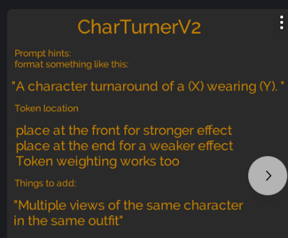

[https://mubu.com/doc/_2As4DSE4m](https://mubu.com/doc/_2As4DSE4m)

【B站第一套系统的AI绘画课！零基础学会Stable Diffusion，这绝对是你看过的最容易上手的AI绘画教程 | SD WebUI 保姆级攻略】 [https://www.bilibili.com/video/BV1As4y127HW/?share_source=copy_web&vd_source=04d4d472f359c9291490f9ae9bdede8e](https://www.bilibili.com/video/BV1As4y127HW/?share_source=copy_web&vd_source=04d4d472f359c9291490f9ae9bdede8e)

秋叶

[https://space.bilibili.com/12566101/channel/seriesdetail?sid=2706990&ctype=0](https://space.bilibili.com/12566101/channel/seriesdetail?sid=2706990&ctype=0)

正向prompt

(masterpiece:1,2), best quality, masterpiece, hires, original, extremely detailed wallpaper, perfect lighting,(extremely detailed CG:1.2),

反向prompt

NSFW, (worst quality:2), (low quality:2), (normal quality:2), lowres, normal quality, ((monochrome)), ((grayscale)), skin spots, acnes, skin blemishes, age spot, (ugly:1.331), (duplicate:1.331), (morbid:1.21), (mutilated:1.21), (tranny:1.331), mutated hands, (poorly drawn hands:1.5), blurry, (bad anatomy:1.21), (bad proportions:1.331), extra limbs, (disfigured:1.331), (missing arms:1.331), (extra legs:1.331), (fused fingers:1.61051), (too many fingers:1.61051), (unclear eyes:1.331), lowers, bad hands, missing fingers, extra digit,bad hands, missing fingers, (((extra arms and legs))),

chilloutmix

CHARTURNERV2

