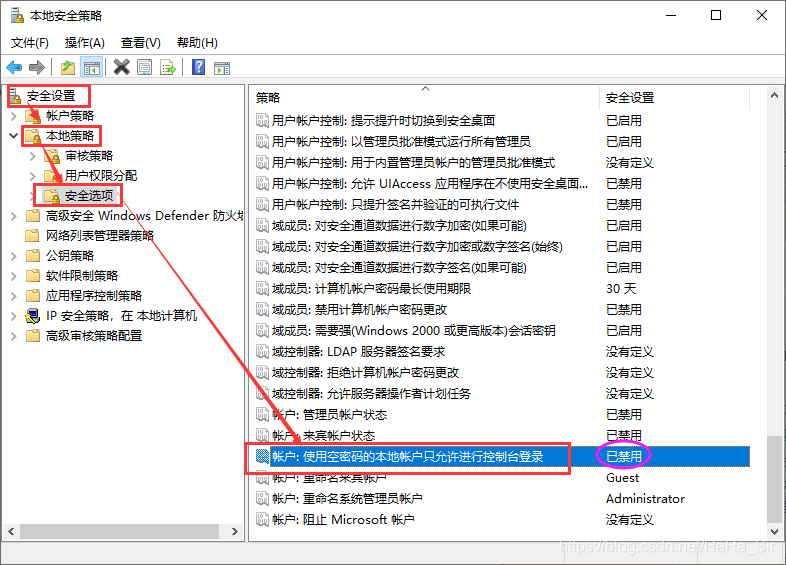

# powershell

用7zr命令行版解压和压缩文件。

解压命令：`7zr a archive.zip filepath`。压缩命令：`7zr x archive.zip`

powershell 中文乱码问题：控制面版，区域，管理，开启beta utf


```powershell
# 安装wifitools
Find-Module -name wifi*
install-module -name wifitools
```

```powershell
#自动连wifi
$status = show-wifiinterface
$str = $status[7].indexof("connected")
while(1 -eq 1){
	if($str -ne 29){
		netsh wlan connect name=AndroidAP
		Start-Sleep -s 3
	}
	Start-Sleep -s 3
	$status = show-wifiinterface
	$str = $status[7].indexof("connected")
}

```

使用 `nano` 在 PowerShell 控制台上编辑文本文件

`nano` 文本编辑器是在 PowerShell 控制台上编辑文本文件的另一种方式。它是一个在终端中使用的小而友好的文本编辑器。你需要安装 `nano` 才能在 PowerShell 上使用它。首先，你必须安装 `chocolatey` 包，这将有助于在系统中安装 `nano`。确保以管理员身份打开 PowerShell 进行安装。

```powershell
Set-ExecutionPolicy Bypass -Scope Process -Force; iex ((New-Object System.Net.WebClient).DownloadString('https://chocolatey.org/install.ps1'))
```
`chocolatey` 包安装后，你可以运行此命令来安装 `nano` 编辑器。

```powershell
choco install nano
```

## 配置pwsh-ssh-server
```powershell
#先安装，从win+i，设置里面安装
start-service sshd
Set-Service -Name sshd -StartupType 'Automatic' # 设置为自动启动
#现在就可以连了，但是电脑需要有本地密码
#用手机JuiceSSH连一下，把连接记录保存进去

#下面是免密登录的问题
#配置文件地址
cd $env:programdata/ssh
cd ~/.ssh
ssh-keygen -t rsa #客户端生成私钥和公钥并且在~/.ssh新建authorized_keys把所有的公钥都存进去
#把JuiceSSH的公钥也存进去
#修改sshd_conf($env:programdata/ssh)
# ————$env:programdata/ssh/sshd_conf
# 确保以下3条没有被注释
PubkeyAuthentication yes
AuthorizedKeysFile	.ssh/authorized_keys
PasswordAuthentication no

# 确保以下2条有注释掉
#Match Group administrators
#       AuthorizedKeysFile __PROGRAMDATA__/ssh/administrators_authorized_keys

#最后一步，删除win的密码
```

## remote desktop无密码连接设置方法



[ThinkPad Win10企业版LTSC，安装UWP离线安装Lenovo Vantage appxbundle安装包](https://www.cnblogs.com/robin415972/p/14617158.html)


