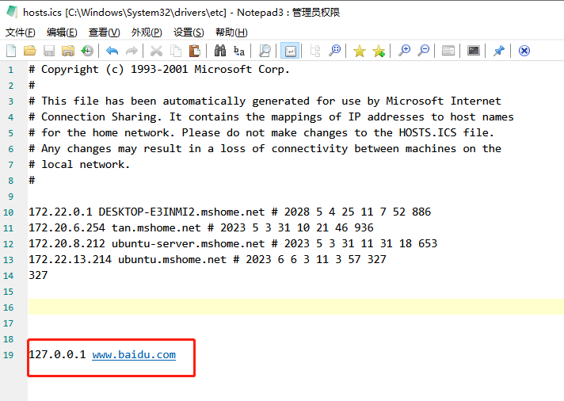
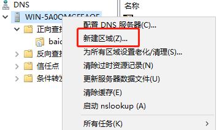
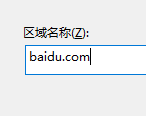
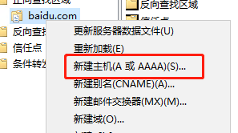
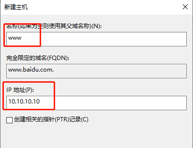
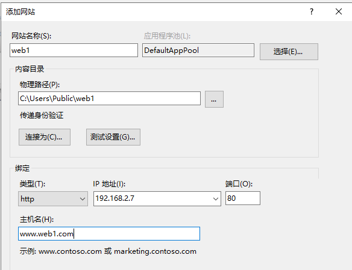

本地hosts文件，是最原始的dns，

现在一般用来屏蔽网站

[C:\Windows\System32\drivers\etc](C:\Windows\System32\drivers\etc)

这样百度就被屏蔽掉了

可以通过抓包来抓到系统某些广告，请求访问哪个地址，然后把这个地址给禁掉，就不弹广告了

可以通过抓包来抓到某个软件要访问某个地址，然后把这个地址给禁掉，避免强制更新，避免向服务器确认是否激活

虚拟机运行windows server（腾讯微云有iso）

在windows server 里安装dns服务

服务器和主机需要在同一网段下

主机得把ipv6关了，才能完全用ipv4

服务器上的dns，如果没有主机要的网站，那先交给转发器，再交给全球dns，全球dns一共13个

windows server建网站

添加web服务器IIS，然后一路下一步

注意，物理路径要设置权限，Everyone权限，否则别人看不了，配置完这个之后要配置dns服务器

物理路径下面要存放index.html

用win10主机打开iis web服务功能，添加站点，别用80端口，然后关闭防火墙，就可以用ipv6地址访问你的网站了

